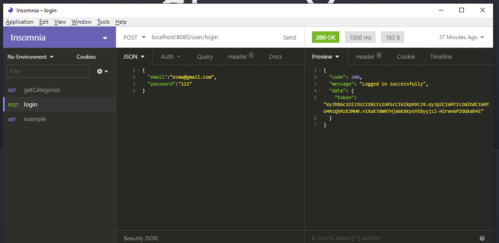

# 📝 Genel Notlar

## 🏗️ Response yapısı

```javascript
{
    code : Int, (value) // "error case'leri için ayrı ayrı code"
    message : String, (value) // "success or error"
    data : <T> (array or object) // "dönen data"
}
```

## 💌 Request yapısı

* 👮‍♀️ `/login` ve `/signup` hariç bütün request'lerin `header`'ında `token` anahtarı olmalı
* 👷‍♀️ `token`'lar login işleminin response'u ile gönderiliyor

### 👩‍⚖️ İlgili response'lar

```javascript
{
  "code": 422,
  "message": "Invalid token"
}
```

## 📢 Back-end Ekibine Yönelik Not

* ➰ Token _decode_ etme işlemi middleware olarak gerçekleştirilmekte
* 🗃️ _Decode_ edilen token `req.body.decoded_id` alanı altında tutulmakta
* 🔑 O anahtar `user_id`'ye denk gelmekte

### 🔑 Token Alma



### 🅾 Token Kullanma \(`header`'da\)


