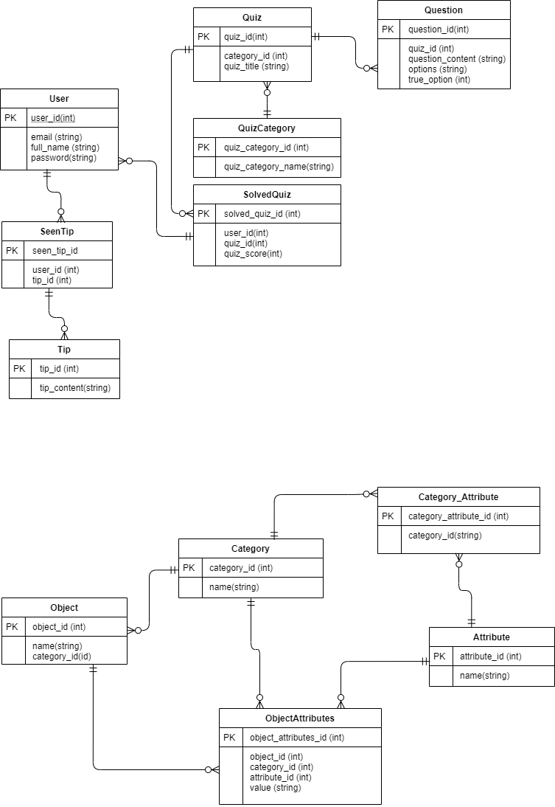

# 🏗️ Veritabanı Şeması



## 📝 Notlar

* 👮‍♂️ Şıklara özgü işlem yapılmayacağı için `Şık` tablosu kurulmamıştır
* ⚙️ Şıklar, `options` alanından çıkarılacak
  * ✨ String Parsing işlemi sorgulardan daha az külfetlidir

